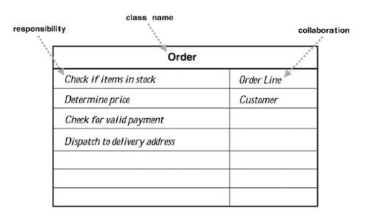

# cellsociety.model.Cell Society Design Lab Discussion
#### Jason Qiu (jq48), Spencer Katz (sek49), Prince Ahmed (pa99)


### Simulations

 * Commonalities
 Every cell has a number of states, and on each step, each cell looks at its immediate neighbors to decide what to do. Fixed, discrete grid.
 
 * Variations
 Number of states, behavior on each step (changing its own state and changing states of neighbors)


### Discussion Questions

 * How does a cellsociety.model.Cell know what rules to apply for its simulation?
 The cell takes a number of states to instantiate. The RuleSet abstract class will have a method that apply the rules takes each cell and its neighbors as input, returning a enum Result that, will be used by a different method in the RuleSet class to update the cell and its neighbors.

 * How does a cellsociety.model.Cell know about its neighbors?
 The game will have a first pass through all of the cells, applying the rules to get a list of results for each cell

 * How can a cellsociety.model.Cell update itself without affecting its neighbors update?
 The game will have a second pass through all of the results for each cell, updating it and its neighbors if needed.

 * What behaviors does the Grid itself have?
 The getUpdates() and updateGrid(). loadGrid() loads a new board state of cells.

 * How can a Grid update all the Cells it contains?
 It runs getUpdates on all cells and then runs updateGrid on all the update results from the first function.

 * What information about a simulation needs to be in the configuration file?
 The ruleset, each state and its color, board size, and  initial board config.

 * How is configuration information used to set up a simulation?
 The ruleset initializes the RuleSet class. The board size determines the board size. The initial board sets up the board.

 * How is the graphical view of the simulation updated after all the cells have been updated?
 Drawer will take a board and for each cell, it looks at the config to determine what to color them.
 

### Alternate Designs

#### Design Idea #1

 * Data Structure #1 and File Format #1

 * Data Structure #2 and File Format #2


#### Design Idea #2

 * Data Structure #1 and File Format #1

 * Data Structure #2 and File Format #2
 
 

### High Level Design Goals


### CRC Card Classes

This class's purpose or value is to represent a customer's order:



This class's purpose or value is to represent a customer's order:

|Order| |
|---|---|
|boolean isInStock(OrderLine)         |OrderLine|
|double getTotalPrice(OrderLine)      |Customer|
|boolean isValidPayment (Customer)    | |
|void deliverTo (OrderLine, Customer) | |


This class's purpose or value is to represent a customer's order:
```java
public class Order {
     // returns whether or not the given items are available to order
     public boolean isInStock (OrderLine items)
     // sums the price of all the given items
     public double getTotalPrice (OrderLine items)
     // returns whether or not the customer's payment is valid
     public boolean isValidPayment (Customer customer)
     // dispatches the items to be ordered to the customer's selected address
     public void deliverTo (OrderLine items, Customer customer)
 }
 ```


This class's purpose or value is to manage something:
```java
public class Something {
     // sums the numbers in the given data
     public int getTotal (Collection<Integer> data)
	 // creates an order from the given data
     public Order makeOrder (String structuredData)
 }
```


### Use Cases

* Apply the rules to a middle cell: set the next state of a cell to dead by counting its number of neighbors using the cellsociety.Game of Life rules for a cell in the middle (i.e., with all its neighbors)
```java
 Something thing = new Something();
 Order o = thing.makeOrder("coffee,large,black");
 o.update(13);
```

* Apply the rules to an edge cell: set the next state of a cell to live by counting its number of neighbors using the cellsociety.Game of Life rules for a cell on the edge (i.e., with some of its neighbors missing)
```java
 Something thing = new Something();
 Order o = thing.makeOrder("coffee,large,black");
 o.update(13);
```

* Move to the next generation: update all cells in a simulation from their current state to their next state and display the result graphically
```java
 Something thing = new Something();
 Order o = thing.makeOrder("coffee,large,black");
 o.update(13);
```

* Set a simulation parameter: set the value of a parameter, probCatch, for a simulation, Fire, based on the value given in a data file
```java
 Something thing = new Something();
 Order o = thing.makeOrder("coffee,large,black");
 o.update(13);
```

* Switch simulations: load a new simulation from a data file, replacing the current running simulation with the newly loaded one
```java
 Something thing = new Something();
 Order o = thing.makeOrder("coffee,large,black");
 o.update(13);
```
