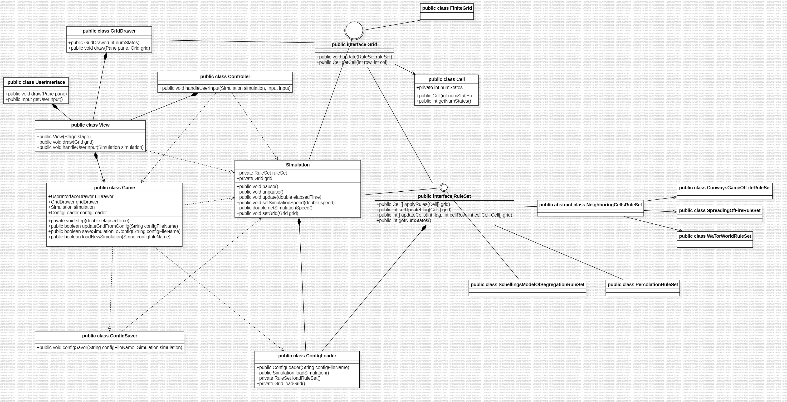

# Cell Society Design Plan
### Team 4
### Spencer Katz, Prince Ahmed, Jason Qiu (jq48)


#### Examples

Here is a graphical look at my design:


made from [a tool that generates UML from existing code](http://staruml.io/).


Here is our amazing UI:


taken from [Brilliant Examples of Sketched UI Wireframes and Mock-Ups](https://onextrapixel.com/40-brilliant-examples-of-sketched-ui-wireframes-and-mock-ups/).

## Introduction
This section describes the problem your team is trying to solve by writing this program, the primary design goals of the project (i.e., where is it most flexible), and the primary architecture of the design (i.e., what is closed and what is open). Discuss the program at a high-level (i.e., without referencing specific classes, data structures, or code).

Example rule:
_ _ _       _ _ _
_ X 1 -> _ _ X
_ _ _      _ _ _

We want to make a program that can run any cellular automata simulation, supporting loading new rulesets and and saving current states. We also want to be able to control different aspects of the simulation, including the timestep. We want the ruleset configuration to be open to extension but want the code that updates the cells to be closed, so that it does not need to be changed for every new simulation.

## Design Overview



## User Interface
This section describes the overall appearance of program's user interface and how the user will interact with your program (keep it very simple to start). Include one or more pictures of the user interface and describe any possible erroneous situations that should be reported to the user (i.e., bad input data, empty data, etc.). These pictures can be hand drawn and scanned in, created with a standard drawing program (such as Figma or PowerPoint), ExcaliDraw (a Markdown-oriented drawing tool!), or screen shots from a dummy program that serves as a exemplar.

[Mockup of the user interface](UserInterfaceMockUp.png)

## Configuration File Format
Configuration files will use the standard XML format that can be parsed automatically by Java, but the exact tag names and attributes you use within this file are up to your team. Create at least two example files to help the team agree on the information represented (such as number of tags, using attributes vs. elements, and other internal formatting decisions). Note, your examples do not need to be exhaustive, just representative of the file's format.

```XML
<config>
<Simulation Type> Game of Life/Percolation </Simulation Type>
<Author> Prince </Author>
<Description> This is an example of what the project will look like </Description>
<Width> 100 <\Width>
<Height> 100 </Height>
<Initial Config>
<Cell row = ‘1’, col = ‘1’ > Alive </Cell>
<Cell row = ‘2’, col = ‘1’ > Empty </Cell>
</Initial Config>
<parameters>
<probability> 0.9 </probability>
<distance> 5 </distance>
</parameters>
</config>
```

## Design Details
### Game
The Game class holds main and all of its attributes and methods are static since there will only ever be one game instance. It initializes the JavaFX stage and user interface before running the game loop, which will repeatedly:
2. tell the View instance to draw the screen (UI and grid)
3. tell the Simulation instance to update (if it exists)
4. tell the View instance to check+handle user input

It is also responsible for loading/saving simulations/grids from/to config files/simulations using ConfigSaver and ConfigLoader.

### ConfigSaver
The ConfigSaver class is responsible for taking a Simulation instance and file path and saving that simulation's details into the file in some XML format.

### ConfigLoader
The ConfigLoader class is responsible for taking a file path and returning a Simulation instance that corresponds to that file's configuration details.

### RuleSet
The RuleSet interface provides the functionality to take a given array of Cell instances and returns an array of the same size with flags. These flags are used by the next method to actually update the cells and returns the updated array of cells. It also returns the number of states the ruleset uses.

Each different simulation (Conway's Game of Life, Spreading of Fire, etc.) implements this interface.

### Grid
The Grid interface provides the functionality to update itself given a particular RuleSet instance.

Different types of grids (e.g. finite or infinite grids) implement this interface.

### Simulation
The Simulation class is responsible for any high-level details regarding when to update the stored Grid instance, such as handling simulation speed and pausing/unpausing, and also holds what RuleSet to use to update it.

### GridDrawer
The GridDrawer class is responsible for drawing the given Grid instance onto the screen given some Group/Pane/StackPane JavaFX object. It makes sure all Cells that are the same state are the same color.

### UserInterface
The UserInterface class is responsible for drawing the user interface given some Group/Pane/StackPane JavaFX object and detecting user input (via buttons, text field, or keypress).

It draws all the buttons and the about box.

### Controller
The Controller class is responsible for telling Game or Simulation what to do given user input (via buttons, text field, or keypress)

### View
The View class is responsible for drawing anything visible on the screen, detecting user input, and handling it. It does this by being instantiated with a Stage JavaFX instance and then dividing up the screen before passing the individual parts to instances of GridDrawer and UserInterface to draw on. It also uses a Controller instance to handle user input events from the UserInterace.


## Use Cases
Describe how your classes work together to handle being extended or specific features (like collaborating with other classes, using resource files, or serving as an abstraction that could be implemented multiple ways).  
In addition to the Use Cases below, write at least two Use Cases per person to further test your design (they should be based on features given in the assignment specification, but should include more details to make them concrete to a specific scenario). Then, include the Java psuedocode needed to complete all the Use Cases to help validate and make your design plan more concrete.


Apply the rules to a middle cell: set the next state of a cell to dead by counting its number of neighbors using the Game of Life rules for a cell in the middle (i.e., with all its neighbors)
The class Game calls the method gridUpdate() in the Class Grid, when it reaches this cell it will send the array as parameters to the RuleSet Class. The RuleSet Class will determine what the state for this cell should be on the next iteration along with the other cells. The array for the next iteration will get returned to the Grid Class. The grid class will go through the rest of the cells and then apply the update.
Apply the rules to an edge cell: set the next state of a cell to live by counting its number of neighbors using the Game of Life rules for a cell on the edge (i.e., with some of its neighbors missing)
This is the same as the previous with special considerations.
Move to the next generation: update all cells in a simulation from their current state to their next state and display the result graphically
The RuleSet Class will determine what the state for the cells should be in the next. The 2d array of the next state will get returned to the Grid Class. The grid class will go through the array and then apply the update. Then the grid drawer class will update the graphical grid on each step.
Switch simulations: load a new simulation from a data file, replacing the current running simulation with the newly loaded one
If the Load New button is selected in the UI, the simulation class is told to stop the simulation. The UI opens a drop down menu which allows the user to select a new file. When this file is selected, the game class is told to reset with a new file. This file is passed to the configloader class which will load the simulation with the new grid object. 
Set a simulation parameter: set the value of a parameter, probCatch, for a simulation, Fire, based on the value given in a data file
ConfigLoader will take in the parameters for certain things such probCatch. It will instantiate a Rule object with the given parameters which will be passed to the simulation class.
The start/stop button
The start or stop button is selected in the UI. This will tell the simulation class to either stop/start the simulation.
How to choose which game will be played
The ConfigLoader will determine which specific rules will be applied. Then an object of this specific type of game will be created and passed to the simulation class to start the simulation.
How will the status of a block be updated for the Model of Segregation?
A Rule object for this specific game will have been created. The grid class will pass in the neighbors as a parameter to the rule class. The rule class will then determine what each cell should be on the next iteration. It will update a variable with the Cell class for what their next state should be. Then rules will run the update grid method. This specific implementation will first find all blank sports in the grid. It will randomly select one spot and move the cell to that spot and move the cell that was there to the other spot. It will update the new blank areas in the grid and continue until all cells that need to be moved have been. It will then return what the grid should be on the next step and the grid will update that.
Adjust the simulation speed
The game loop calls UI.handleUserInput(simulation), which finds that the user has updated the simulation speed, so it tells simulation to set a new speed using simulation.setSimulationSpeed(). Then when the game calls simulation.update(elapsedTime), it keeps track of how much time has passed in comparison to its stored simulation speed to decide whether or not to actually call grid.update()
Start the program
Game is the main class. This will call the UI which will create a screen asking for a file. A file will be selected. Then Game will call ConfigLoader which will load this file. ConfigLoader will create a RuleSet and Grid object which will be given to a simulation object which is also created in ConfigLoader. Game will call a method which continuously tells UI and simulation to update.
Save a file
The UI will determine if a save file button was pressed. This will call a static method in game that will taken the current grid and game information and convert this to an xml file.

## Design Considerations
This section justifies your team's reasoning for the classes and methods given in the design, including alternatives considered with pros and cons from all sides of the discussion. Describe in detail at least two design issues your group discussed at length (even if you have not yet resolved it), including pros and cons from all sides of the discussion and the alternate design options considered.

Design consideration 1
One key design consideration was how to manage the grid for our simulation. Initially, we considered storing the grid directly as a 2D matrix within the game class, allowing for easy access and updates:

Pros:
Direct Access: Simplifies grid manipulation within the game logic.
Simplicity: Keeps the design straightforward.

Cons:
 Single Responsibility Principle Violation: Could violate the SRP by mixing grid management with game logic.
Reduced Modularity: May lead to less modular and harder-to-maintain code.

To address these issues, we introduced a dedicated Grid class, acting as an intermediary between the Game and Rules classes. The Grid class handles grid management, updates, and queries:

Pros:
Open and closed principle: If we need to add new functionality to the grid (like making it infinite, or implementing in a different way) we are allowing the grid class to be open to do this. On the other hand the functions on the grid will stay closed.
Improved Modularity: Enhances code modularity and maintainability.
Clear Responsibilities: Ensures each class has a focused role, adhering to SRP.


Cons:
Indirect Access: Requires the Game class to interact with the Grid class for grid operations.

The advantages of introducing a Grid class, such as improved modularity and adherence to SRP, outweigh the cons so we decided to implement it.

Design consideration 2
Organization of responsibilities among classes, specifically, whether to introduce a separate Simulation class and decide which component should handle the simulation loop. This discussion emerged from the need to manage user interactions like loading new simulation configurations and handling ongoing simulations. 

Simulation Class

We considered incorporating a Simulation class. This class would be responsible for managing the simulation's state, updating the grid, and applying the simulation rules. However, we opted for the Game class to handle the simulation loop. The Game class constantly calls the Simulation class to update itself and checks with the UI class for any user-triggered changes, such as loading a new configuration. We decided against letting the UI class handle simulation termination and new configurations. The Game class, which oversees the simulation loop, can effectively manage the termination of the current simulation and the initiation of a new one based on user input.

Pros:
Clear Separation of Concerns: Introducing a Simulation class would provide a clear separation of concerns, ensuring that each class has a distinct and well-defined responsibility.
Modularity: Modularity in the codebase would be enhanced, making it easier to maintain, extend, and test.
Single Responsibility Principle (SRP): Each class would adhere to the SRP 

Cons:
Complexity: Introducing a Simulation class might add complexity to the overall design, potentially requiring additional method calls and inter-class communication.
Game class size: game class is kind of overviewing everything and may be too big


## Team Responsibilities
This section describes the parts of the program each team member plans to take primary and secondary responsibility for and a rough schedule of how the team will complete the program.

Classes: 

 * Spencer #1
All Rules
Grid
Cells
 * Prince #2
ConfigFile
Game
Simulation
 * Jason #3
View and controller portion of the project

